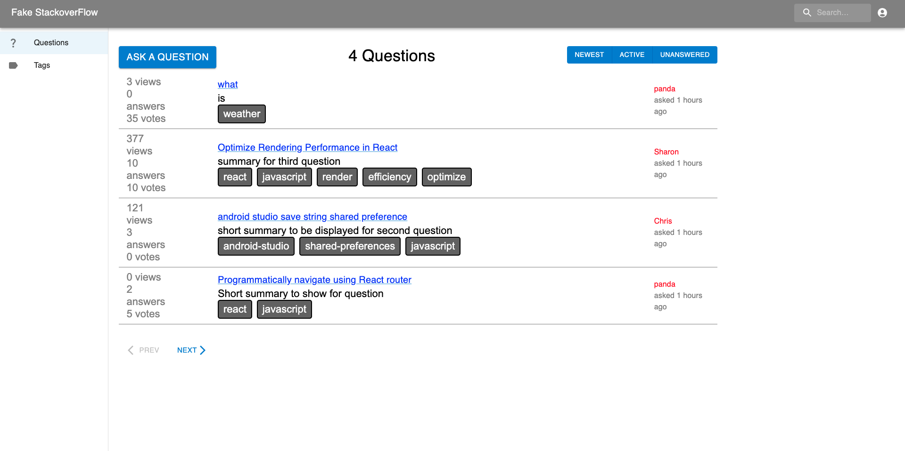

[](https://classroom.github.com/a/9NDadFFr)
Add design docs in *images/*

# Instructions to setup and run project


## Set up
Download/clone the personal GitHub repository
```
git clone https://github.com/sbu-ckane-f23-cse316-projectorg/projectfakeso-shalo-gophers.git
```
You will want to navigate to the directory of the folder this project is located in. The repository has a **server** and **client** directory. 

Each directory has the package.json and package-lock.json files which list the dependencies of the server and client applications respectively. In each of the directories run
**npm install to install** the necessary dependencies.

```npm install```

We will use the express framework to write server-side code and the mongoose data modeling library, nodemon as our process manager, and the axios library to send HTTP requests. We will be using MaterialUI to streamline the frontend user experience, bcrypt for hashing passwords, cors for file sharing, cookie-parser to populate cookies, and json web token for our authentication system.
Install the following commands, if not already installed:

```
npm install express
npm install mongoose
npm install nodemon
npm install @mui/material @emotion/react @emotion/styled
npm install @mui/material @mui/styled-engine-sc styled-components
npm install @mui/icons-material
npm install bcrypt
npm install cors
npm install cookie-parser
npm install jsonwebtoken
```

## Getting Started

After installing all your npm commands, you will navigate to the client folder in the terminal to start the server using **cd client**

To start your cpplication, use the command 
```npm start```
*Running this command will open a local host server at port 3000. The application will automatically open in a browser. If it does
not then manually open http://localhost:3000/ in a browser.*

Then, navigate back out into the main folder of this project and head to the server directory by using **cd server** . Type the folliwing in the terminal: ```nodemon server.js```  On running the script, a server should start in https://locahost:8000. Further, the server should connect to a running instance of
MongoDB on server launch.

For MongoDB, the server side should connect to: mongodb://127.0.0.**1:27017/fake_so**

The figure below shows the summary of the default/port settings


To populate the database assuming it is empty, run the following command in the **server** directory: 

```node init.js [username] [password]```

Enter the first argument is the username and the second argument is the password. This will be used to generate the admin user. By default, the user's email will be **admin@gmail.com** 

Right now, the current data base is instantiated with the following users: 


# Fake Stack Overflow

## Log in
If everything is working well, you will see the first page which is the **Log In** page. This is where you'll be able to sign up if you are a new user. You may use the admin account you just created to log, log in as a gues, or sign up.


## Sign Up
As a new user, you will have the option to naviagate to the sign up page where you can create a **username**, enter your email, and **password**. Errors will appear if you entered the information incorrectly. After a successful sign up, you will be naviagted back to the login screen where you can enter your new account. 


## Questions Page
Whether you are a new, returning, or guest user, you will be able to head to the **Questions Page** which is where you can see all the questions. To refresh the application click on the Questions Tab on the Sidebar. There are multiple functionalities of this page which includes:

1. Ask a Question
2. Sort Questions (Newest, Active, Unanswered)
3. Search Question
4. View a Question 
5. View Tags
6. Check Out User Profile



## Ask Question
If you decide to click the **Ask A Question** button, you will be ale to create a question card to post onto Fake Stack Overflow. You'll be allowed to enter several information like the title, summar, text, and tags. If the entered information is valid, you will be able to submit and view your question back in the **Questions Page**. Other features in the page also includes navigating back to the questions page without creating a question, view the tags, and user profile. 


## Sort and Search Questions

Sorting questions will allow you to view questions that have been posted in different order. Currently the questions are defaultet to display by date. Other sorting orders include Active and Unanswered. You can also search the questions using the search bar. This is done by searching for key words or tags. 


## View Question
By clicking on a question in the Questions Page, you can view in detail the content of the question. You can view the title, summary, and tags of the question. Below the question card is the answers and comments in which you can view by clicking Prev and Next. Other functionalities include up voting or down voting, submitting a comment to the question or to the answers, and answering the question. Note that certain fuctionalities will be disabled given your reputation. If you wish to no longer view this question, you can return back to the Questions Page or view the Tags, ask a question, or go to your User Profile Page. 


## Tags Page

The Tags Page consist of all the generated tags by all the users. You can click on each tag card and view the questions that are associated with this tag. Other functionalities include: navigating to the Questions Page and going to the User Profile Page. 


## User Profile
The user Profile page can be accessed via the profile icon in the App Banner next to the search bar and then selecting [User]'s Profile from the popup. The user profile by default will load the data from the user that can be edited. Users can choose a question title which will take them to a form to resubmit their question or delete it. Additionally users can switch between editing their tags or answer on a question they answered.
. 
Upon selecting a question the user answered, they can view the question page of the question answered with the option to edit or delete the answer they submitted and upon editing it will allow the user to edit an answer similarly to a tag.

Admins additionally will be able to edit, or delete a user. When the admin selects a user to edit they will be redirected to the corresponding users user page and be allowed to edit their page. 


# Finals Comments
If you are reading this it means you have reached the end of this README.md and have read everything needed to run this project. Thank you for your time and we hope you enjoyed our project!


## Team Member 1 Contribution Christopher Lobato
Backend Routes for Questions, Comments, Answers
Question Page
HomePage
Comment Card Component implementation
User Profile Page Implementation
Auth Router, user authentication
Login Register Screens
init.js

## Team Member 2 Contribution Sharon Guan
Backend Routes for Questions, Comments, Answers, Users
Visual Errors for the Ask Question, Answer Question, Tag Editing
Answer Card component implementation
Question Cards component implemenation
Errors Login Register Screens
init.js